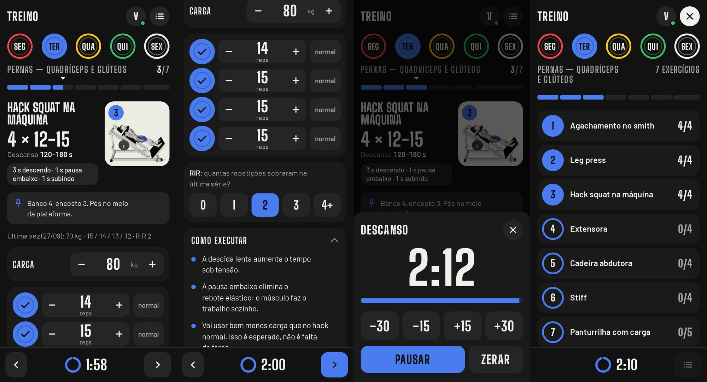
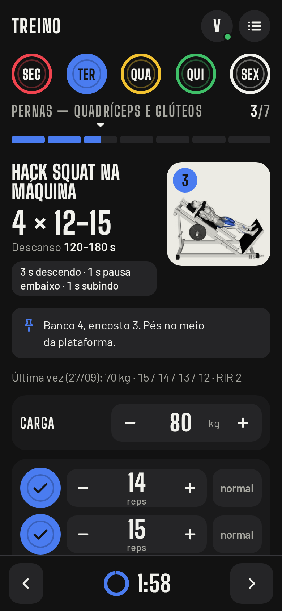
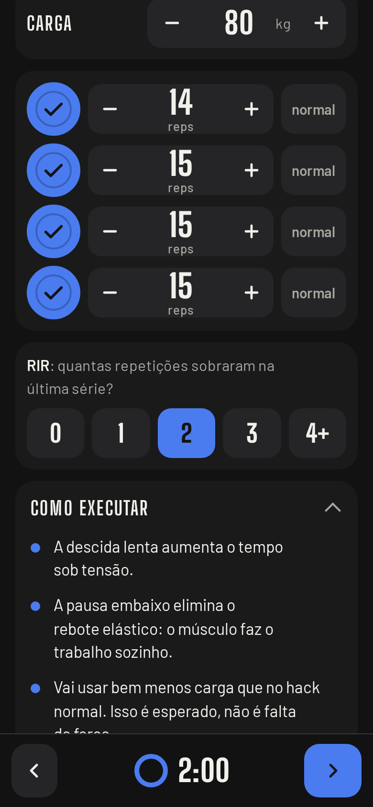
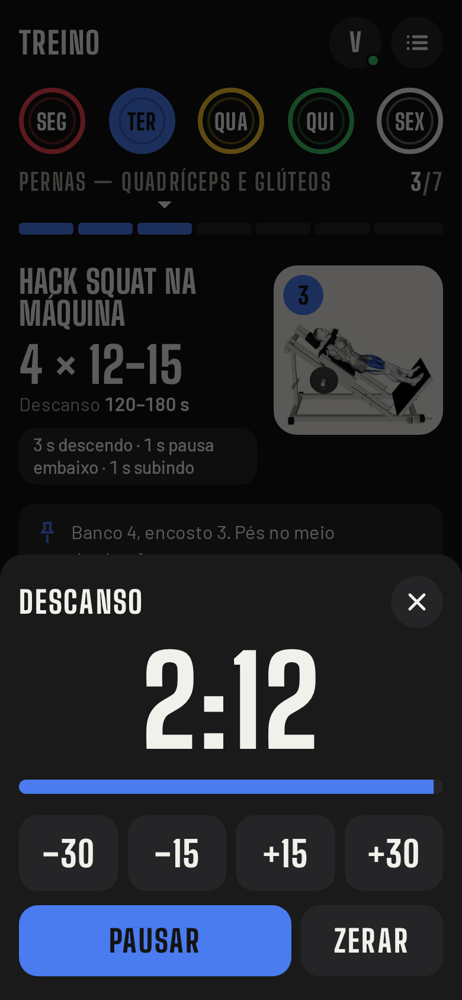
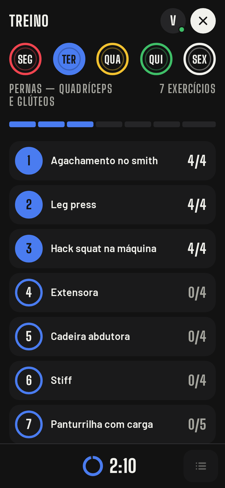
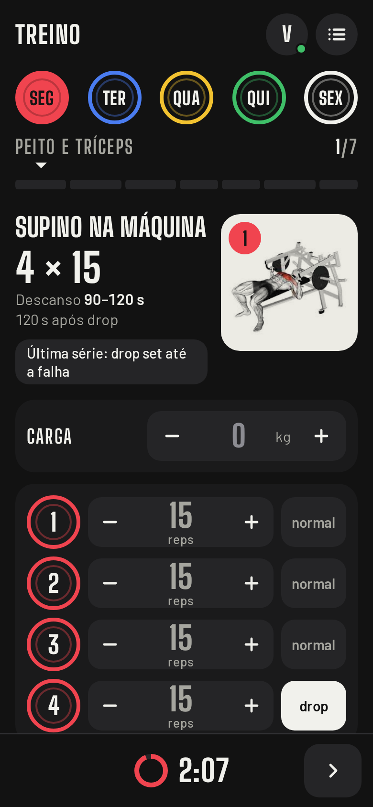
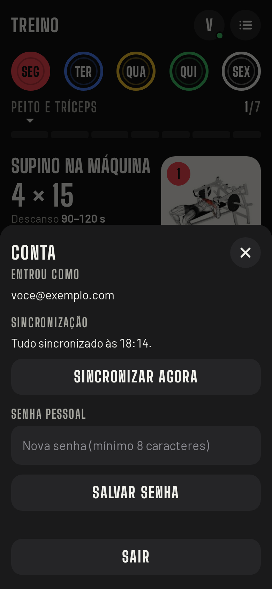
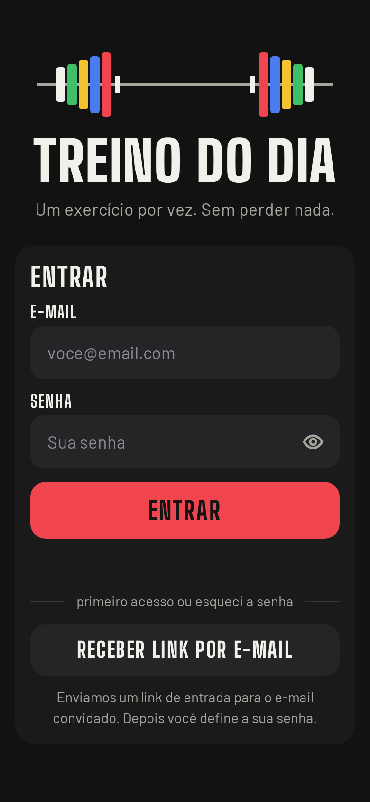
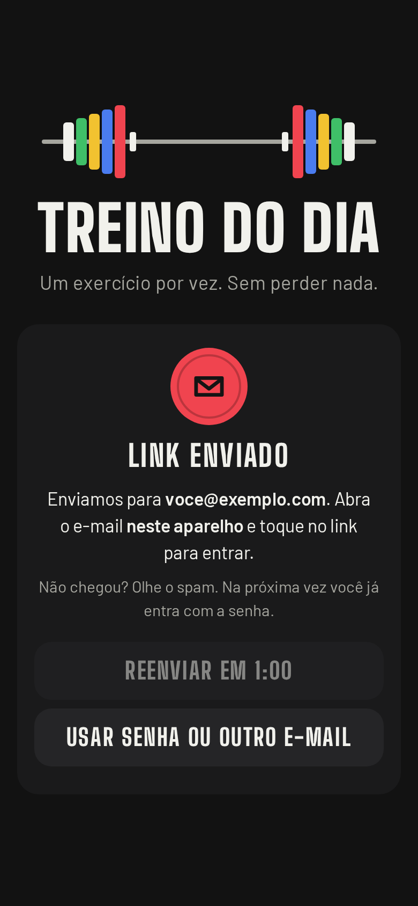
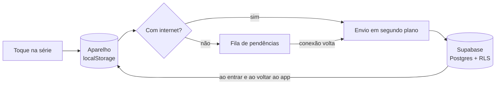

<h1 align="center">Treino do dia</h1>

<p align="center">
  Um assistente de treino para o celular: escolha o treino do dia e siga exercício por exercício,<br>
  com a ilustração, as séries, o descanso e tudo o que você registra na mão, mesmo sem internet.
</p>

<p align="center">
  <a href="https://gym-stuff-five.vercel.app"><b>Abrir o app</b></a>
  &nbsp;·&nbsp;
  <a href="#como-funciona-por-dentro">Como funciona</a>
  &nbsp;·&nbsp;
  <a href="#rodar-localmente">Rodar localmente</a>
</p>

<p align="center">
  
</p>

## Sobre

Fichas de treino costumam chegar em PDF: bonitas, mas difíceis de usar entre uma série e outra. Você fica
rolando a tela atrás do exercício, não tem onde anotar a carga e ninguém te lembra de descansar.

Este projeto transforma a ficha em um **app de uso com uma mão**. Ele mostra só o exercício da vez, guarda o
que você fez e cuida do descanso. Foi pensado para duas pessoas que treinam juntas e seguem a mesma ficha,
cada uma com as próprias cargas, notas e histórico.

O que guiou as decisões:

- **Um toque por série.** Registrar não pode atrapalhar o treino.
- **O exercício atual manda.** O que você precisa agora fica à vista e o resto fica por perto.
- **Legível de relance**, em pé, com o celular na mão e luz de academia.
- **Nunca perder um treino.** O app grava primeiro no aparelho e envia depois, então falta de sinal não atrapalha.

## O que faz

| | |
|---|---|
| **Um exercício por vez** | Ilustração, séries × repetições, técnica (drop set, isometria, tempo) e cues de "como executar". |
| **Registro de séries** | Repetições por série, carga com passo de 2,5 kg, tipo da série (normal, drop, pausa) e RIR no fim do exercício. |
| **"Última vez"** | Mostra a carga e as repetições da sessão anterior do mesmo exercício. |
| **Descanso sugerido** | Cada exercício traz a faixa de descanso, e o timer começa sozinho ao concluir a série. |
| **Timer ajustável** | Toque no tempo para abrir a folha de ajuste: −30, −15, +15, +30 s, pausar e zerar. |
| **Nota por exercício** | Ajuste de máquina ("banco 4, encosto 3") fica fixado no topo do exercício. |
| **Dias como anilhas** | Cada dia da semana é uma cor de anilha olímpica, e a régua no topo mostra o progresso do treino. |
| **Resumo do treino** | Todos os exercícios do dia com quantas séries faltam. |
| **Sem internet** | Abre e funciona offline, e sincroniza quando a conexão volta. Pode ser instalado na tela inicial. |
| **Conta pessoal** | Entra com e-mail e senha. O link por e-mail serve para o primeiro acesso e para quem esqueceu a senha, com intervalo de 1 minuto entre pedidos. Cadastro fechado: só e-mails convidados entram. |

## Telas

<table>
  <tr>
    <td align="center"><br><sub>Exercício em andamento</sub></td>
    <td align="center"><br><sub>RIR e como executar</sub></td>
    <td align="center"><br><sub>Timer de descanso</sub></td>
    <td align="center"><br><sub>Resumo do treino</sub></td>
  </tr>
  <tr>
    <td align="center"><br><sub>Outro dia, com drop set</sub></td>
    <td align="center"><br><sub>Conta e sincronização</sub></td>
    <td align="center"><br><sub>Entrada</sub></td>
    <td align="center"><br><sub>Primeiro acesso: link por e-mail</sub></td>
  </tr>
</table>

As telas mostram dados de exemplo.

## Como funciona por dentro

O app é **offline-first**: toda alteração grava no aparelho na hora e vai para o banco em segundo plano.



- **Envio idempotente.** As chaves das tabelas são naturais (usuário, dia, exercício, série), então reenviar o mesmo
  registro atualiza em vez de duplicar.
- **Alteração local vence.** Se há algo ainda não enviado, o que vem do banco não sobrescreve.
- **Indicador de sincronização.** O ponto na sua inicial mostra verde (sincronizado), amarelo (pendente ou sem internet) ou vermelho (falha, com nova tentativa automática).
- **Modo offline de verdade.** O `sw.js` guarda o app, as fontes, as imagens e o cliente do Supabase.

### Segurança

- **Cadastro fechado no banco.** Um gatilho em `auth.users` recusa qualquer e-mail que não esteja em `allowed_emails`,
  independentemente de configurações do painel.
- **RLS em todas as tabelas de dados.** Cada pessoa só lê e grava as próprias linhas. O catálogo de exercícios é somente leitura.
- **A chave `sb_publishable_…` no código é pública por desenho.** Quem protege os dados é o RLS, não o segredo da chave.

### Stack

- HTML, CSS e JavaScript puro em um único `index.html`. Sem build.
- [Supabase](https://supabase.com): Auth e Postgres. O esquema está em [`supabase/schema.sql`](supabase/schema.sql).
- [Vercel](https://vercel.com), com deploy automático a cada push na `main`.
- `vendor/supabase.js` é o `@supabase/supabase-js` 2.117.2, hospedado junto para funcionar offline.
- Fontes Barlow e Big Shoulders Display (SIL Open Font License), também hospedadas.

## Rodar localmente

```sh
python3 -m http.server 8000
```

Abra `http://localhost:8000`. Para entrar você precisa de um projeto Supabase seu:

1. Aplique [`supabase/schema.sql`](supabase/schema.sql) e cadastre os e-mails permitidos:
   `insert into public.allowed_emails (email) values ('voce@exemplo.com');`
2. Troque `SB_URL` e `SB_KEY` no `index.html` pelos do seu projeto.
3. Em Authentication → URL Configuration, adicione `http://localhost:8000` e a URL do seu deploy.

## Próximos passos

- Volume semanal por grupo muscular, calculado a partir das séries.
- Sugestão da próxima carga por dupla progressão.
- Ficha editável por pessoa.

## Ilustrações

As imagens em `img/` foram extraídas de uma ficha de treino em PDF e vêm de sites de terceiros, algumas com
marca d'água. Estão aqui só para uso pessoal, e os direitos são dos autores (veja
[`img/PROVENANCE.md`](img/PROVENANCE.md)). Se você for autor de alguma e quiser a remoção, abra uma issue.
